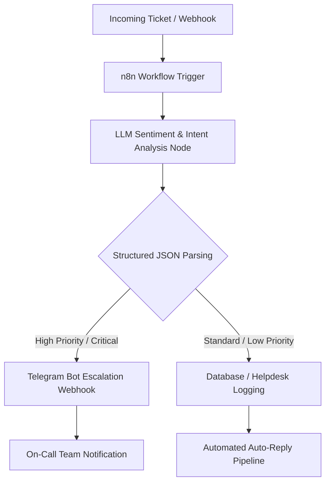

# 🤖 Automated AI Triage System

> An event-driven, AI-powered customer ticket triage and automated escalation pipeline built with **n8n**, **LLM APIs (DeepSeek / OpenRouter)**, and **Telegram Webhooks**.

---

## 🎯 Overview

Manual support ticket handling creates response bottlenecks and delays critical issue resolution. 

This project delivers an automated, production-ready middleware pipeline that ingests customer support queries, evaluates intent and sentiment using Large Language Models, generates structured JSON classification, and instantly escalates high-priority incidents to on-call engineers via Telegram.

---

## 🏗 System Architecture



---

## ✨ Key Features

* **LLM-Driven Sentiment & Priority Scoring:** Evaluates urgency, customer tone, and urgency category in real-time.
* **Structured Output Normalization:** Enforces strict JSON formatting from LLMs for reliable downstream processing.
* **Conditional Routing Logic:** Instantly flags critical errors (e.g., payment failures, system outages) and escalates them to alert channels.
* **Asynchronous Webhook Integration:** Decoupled architecture allowing easy integration with MedusaJS, Zendesk, Crisp, or custom backends.

---

## 🛠 Tech Stack

* **Orchestration:** n8n (Workflow Automation)
* **AI/LLM Models:** DeepSeek / OpenAI / OpenRouter API
* **Notifications:** Telegram Bot API
* **Protocols & Formats:** REST APIs, Webhooks, JSON, RegEx

---

## 📩 Payload Example

### Input (Raw Customer Message):
```json
{
  "ticket_id": "TICK-9021",
  "customer_id": "usr_88203",
  "message": "My payment went through for the UI theme pack, but the download link returns a 500 Server Error! Please fix this ASAP!",
  "timestamp": "2026-07-26T14:30:00Z"
}
```

### Processed Output (AI Analysis):
```json
{
  "ticket_id": "TICK-9021",
  "category": "Billing & Asset Delivery",
  "sentiment": "Negative / Urgent",
  "priority": "HIGH",
  "action_required": "Immediate Manual Review & Asset Link Regeneration",
  "summary": "Customer charged successfully but facing 500 error on asset download link."
}
```

---

## 🚀 Quick Start

### Prerequisites
* Self-hosted or Cloud **n8n** instance.
* API key from **OpenRouter / DeepSeek / OpenAI**.
* A **Telegram Bot Token** and `chat_id` for incident escalation.

### Installation
1. Clone this repository:
   ```bash
   git clone https://github.com/Artfarreltuta/Automated-AI-Triage-System.git
   ```
2. Import the `workflow.json` file into your n8n interface.
3. Configure your credentials in n8n (`OpenRouter API` and `Telegram Bot API`).
4. Activate the workflow and use the Webhook URL as your API endpoint.

---

## 📄 License

Distributed under the MIT License. See `LICENSE` for more information.
